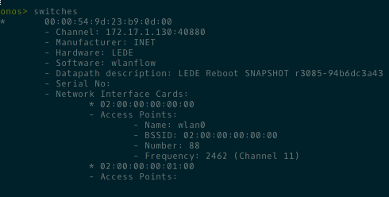

# SDWN for ONOS/LEDE

SDWN is short for Software-Defined Wireless Networking. This project comprises an SDWN control application running on top of an [ONOS](https://onosproject.org) SDN controller as well as an agent for [LEDE](https://ledeproject.org). The two communicate through an OpenFlow control channel. The agent provides the controller with information about Wifi access points and their associated clients. The controller offers the ability to centrally manage parameters of the wireless network and to monitor its state. For example, access points can be instructed to change their operating channel and clients can be forced to disconnect or be banned from association altogether.

## Controller

The SDWN controller runs on top of the ONOS SDN controller's OpenFlow subsystem that has been provided with the necessary driver for the SDWN protocol extensions. Its job is to maintain the control channel with the network elements (the LEDE access points) and to provide abstractions of the underlying network to applications and network operators through its various interfaces.

As an example, this is what the ONOS CLI outputs about connected LEDE switches:

Source code and documentation:
- [modified ONOS](https://github.com/berlin-open-wireless-lab/sdwn-onos)
- [SDWN controller](https://github.com/berlin-open-wireless-lab/sdwn-controller)

## Agent

The agent - called _wlanflow_ - that is running on the Wifi boxes is responsible for the communication with the controller.It is a LEDE daemon written in C leveraging the [Indigo](https://github.com/floodlight/indigo) OpenFlow agent framework. During the handshake with the controller, it learns about the wireless features of its machine and informs the controller about them. When the controller sends a query or a command, it is the agent's job to execute and respond.

The repository linked to below is meant to integrate with the LEDE build system as a feed.

Source code and documentation:
- [wlanflow](https://github.com/berlin-open-wireless-lab/sdwn-agent)

## Protocol

The SDWN controller and the SDWN agent speak an extended version of OpenFlow 1.3. Libraries for the controller and agent are generated using a modified version of [Loxigen](https://github.com/floodlight/loxigen).

Source code:
- [Loxigen with SDWN extensions](https://github.com/berlin-open-wireless-lab/sdwn-loxigen)